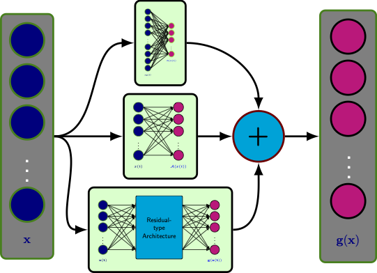

# LQResNet: A Deep Neural Network Architecture for Learning Dynamic Processes

This repository contains the Python implementation using the PyTorch framework of deep learning of learning dynamical systems using a Linear-Quadratic-Residual Network (LQRes-Net) as shown below. 

     
     
The network utilizes the fact that, very often, the rate of a variable in a dynamical process heavily depends linearly and quadratically on the involved variables. Moreover, it is possible to design hand-engineered variables (called lifted variables) such that the dynamics can be written approximately in quadratic-form [2]. Additionally, it has been discussed in [1] how prior information of a dynamical system can be incorporated in build a network and in training.  Use the `runme_*.py` files to generate the results and plots.

## Contains
* `results` contains figures reported in the paper, and trained models are saved in the folder. Moreover, we note that the scripts are set such that they load the trained models in the folder. If one wishes to train as well, please set `training_model'` in `parameters class` in the `runme_*.py` to `True`.
* `Functions` contains externalized Python routines.

## Dependencies
For reproducibility, we have stored all dependencies and their versions in `environment.yml`.

## Licenese
See the [LICENSE](LICENSE) file for license rights and limitations (MIT).

## References
[1]. P. Goyal, and P. Benner, LQResNet: [A Deep Neural Network Architecture for Learning Dynamic Processes](https://arxiv.org/abs/2103.02249), arXiv:2103.02249, 2021.

BibTeX
<pre>
@TechReport{morGoyB21a,
author =       {Goyal, P. and Benner, P.},
title =        {{LQResNet}: A Deep Neural Network Architecture for Learning Dynamic Processes},
institution =  {arXiv},
year =         2021,
type =         {e-print},
number =       {2103.02249},
url =          {https://arxiv.org/abs/2103.02249},
note =         {cs.LG}
}</pre>

[2]. Qian, E., Kramer, B., Peherstorfer, B., and Willcox, K., Lift & Learn: [Physics-informed machine learning for large-scale nonlinear dynamical systems](https://www.sciencedirect.com/science/article/abs/pii/S0167278919307651?via%3Dihub). Physica D: Nonlinear Phenomena, Vol. 406, 2020, 132401.

BibTeX
<pre>
@article{QKPW2020LiftAndLearn,
title   = {Lift \& Learn: Physics-informed machine learning for large-scale nonlinear dynamical systems.},
author  = {Qian, E. and Kramer, B. and Peherstorfer, B. and Willcox, K.},
journal = {Physica {D}: {N}onlinear {P}henomena},
volume  = {406},
pages   = {132401},
url     = {https://doi.org/10.1016/j.physd.2020.132401},
year    = {2020}
}
</pre>

[3]. [*ROM Operator Inference Python 3 package*](https://github.com/Willcox-Research-Group/rom-operator-inference-Python3)

